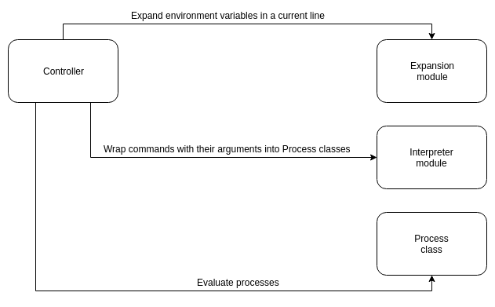
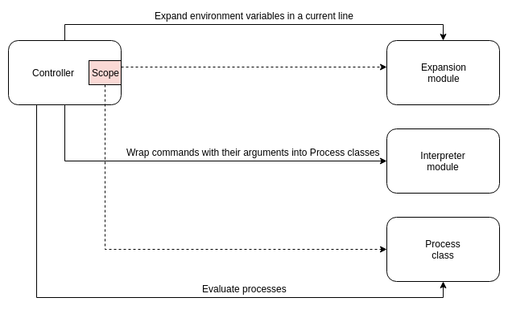

# Architecture of CLI



## Controller

* Controller prompts user to start or continue typing, reads the input line by line and passes lines to the Expansion module. 
* Then the whole expanded command is passed by Controller to an Interpreter to be split into several Processes.
* Controller runs resulting processes in the given order and passes them inputs and a shell environment.



### Expansion module
Iterates through the line, expands environment variables depending on quotes and returns a line split into words as a result.

### Interpreter
Iterates through tokens, classifies them and wraps into Processes.

### Process
Base class has an abstract method ```run(input, scope)```, which allows Controller to manipulate piped inputs.

# Parsing arguments with Docopt

I've considered three possible libraries for parsing arguments of ```grep``` command:

- [ ] __Click__ doesn't support parsing arguments from string or list of strings.
- [ ] __Argparse__ is a standard Python solution. A separate method call with several named parameters is required to define each argument.
- [x] __Docopt__ generates an argument parser from a docstring with usage description in usual format.

The Docopt solution is more maintainable than one using Argparse. Changing command declaration is as easy as rewriting the docstring. Therefore, you never forget to update the documentation after an implementation has changed.

The disadvantage is the value of argument ```--arg``` is accessed as ```args["--arg"]``` which makes renaming arguments a bit of a pain. It isn't much better with Argparse which allows doing ```args.arg``` since it's still hard to detect an absent generated property (PyCharm 2018.3.4 failed to).
